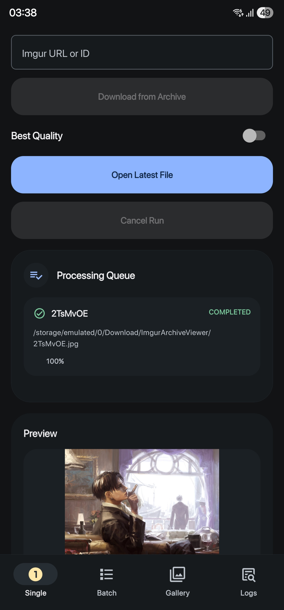

# Imgur Archive Viewer

A React Native Android app for recovering deleted or archived Imgur media via the [Internet Archive Wayback Machine](https://archive.org/).

<p align="center">
  
</p>


## Features

- **Single download**: Paste any Imgur URL or bare media when you only need one file.

- **Batch download**: Pick a `.txt` file of Imgur URLs to process them all.

- **Download queue**: Live per-item updates.

- **Retry on failure**: Optionally retry any failed IDs in one tap.

- **Best Quality mode**: Toggleable scan order that prioritises video formats (`.mp4`, `.webm`, `.gif`) over static images

- **In-app preview**: Inline preview of the most recently downloaded file below the queue

- **Gallery tab**: Browse everything you've recovered from the archive.

- **Logs tab**: Verbose activity log for the current session.

- **Cancel**: Gracefully abort in-progress runs.


## Getting Started

### Requirements

| Tool        | Version             |
|-------------|---------------------|
| Node.js     | ≥ 18                |
| Java        | 17                  |
| Android SDK | API 24+ recommended |

### Install dependencies

```bash
npm install
```

### Start Metro bundler

```bash
npx react-native start
```

### Run on an emulator or device

```bash
npx react-native run-android
```

> **Physical device over USB?** Run `adb reverse tcp:8081 tcp:8081` first so the device can reach Metro.


## Release Builds

### Local APK

**macOS / Linux:**
```bash
cd android && ./gradlew assembleRelease
```

**Windows (PowerShell):**
```powershell
cd android; .\gradlew.bat assembleRelease
```

The unsigned APK is output to `android/app/build/outputs/apk/release/`.

## Tech Stack

- [React Native](https://reactnative.dev/) 0.80 · [React](https://react.dev/) 19 · TypeScript
- [React Native Paper](https://callstack.github.io/react-native-paper/) — Material Design 3 UI components
- [react-native-fs](https://github.com/itinance/react-native-fs) — filesystem & download API
- [react-native-video](https://github.com/TheWidlarzGroup/react-native-video) — video playback in the gallery
- [react-native-vector-icons](https://github.com/oblador/react-native-vector-icons) — Material Community Icons


## License

[CC BY-NC-SA 4.0](https://creativecommons.org/licenses/by-nc-sa/4.0/)


## Acknowledgements

- [Internet Archive](https://archive.org/) for preserving the web
- [Wayback CDX Server API](https://github.com/internetarchive/wayback/tree/master/wayback-cdx-server) for making archived snapshots queryable
